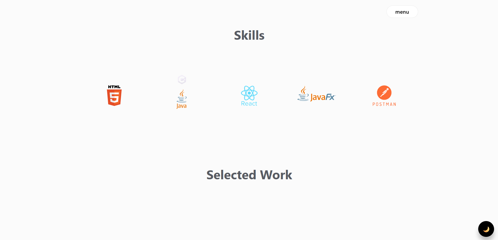

# 🌟 iLuminase Portfolio & Blog

> **Modern Personal Portfolio & Technical Blog** - Showcasing programming expertise and sharing knowledge in computer networking and software development.

[](https://iluminase.github.io/)
[](https://github.com/iLuminase/iLuminase.github.io)
[](./LICENSE.md)

---

## 🚀 Overview

A **comprehensive portfolio website** combining professional showcase with an **interactive blog platform**. Built with modern web technologies to demonstrate full-stack development skills while sharing technical knowledge about networking, programming, and software engineering.

 

## Skills Sections



### 🎯 **Key Highlights**

- **📚 Technical Blog** with interactive features (like, share, comment per post)
- **💼 Portfolio Showcase** with project galleries and skill demonstrations
- **🎨 Modern UI/UX** with light/dark theme switching
- **📱 Fully Responsive** design across all devices
- **⚡ Performance Optimized** with SEO best practices

---


## 📁 Project Structure

```
📦 iLuminase.github.io/
├── 📄 index.html              # Main portfolio page
├── 🎨 style.css               # Core styling and theme system
├── ⚡ script.js               # Main JavaScript functionality
├── 📂 pages/                  # Blog and additional pages
│   ├── 📝 blog-list.html      # Blog listing page
│   ├── 📄 blog-*.html         # Individual blog posts
│   ├── 🎨 blog-styles.css     # Blog-specific styling
│   ├── ⚡ blog-script.js      # Blog functionality (likes, comments)
│   ├── 📂 components/         # Reusable HTML components
│   └── 📂 data/               # JSON data for dynamic content
├── 🎯 assets/                 # Static assets
│   ├── 🖼️ images/            # Optimized images and icons
│   └── 🔤 fonts/             # Web fonts
└── 📋 README.md              # This file
```

---

## 🌟 Blog System Architecture

### **Interactive Features**

- **👍 Like System**: Per-post like counts with visual feedback
- **💬 Comment System**: Persistent comments with user attribution
- **🔄 Share Functionality**: Native sharing with clipboard fallback
- **🎯 Storage Management**: Separate data per blog post

### **Dynamic Content**

- **📊 JSON-Driven**: Blog metadata managed through `posts.json`
- **🖼️ Auto Image Detection**: Dynamic thumbnail extraction
- **🏷️ Category Support**: Organized content with filtering capabilities

---


## 🎨 Customization

### **Adding New Blog Posts**

1. Add post metadata to `pages/data/posts.json`
2. Create HTML file in `pages/` directory
3. Include blog components and styling
4. Test interactive features (like, share, comment)

### **Theme Customization**

Modify CSS custom properties in `style.css`:

```css
:root {
  --primary: #your-primary-color;
  --bg-color-primary: #your-background;
  /* ... other variables */
}
```

---

## 📞 Contact & Connect

- 🌐 **Website**: [iLuminase.github.io](https://iluminase.github.io/)
- 💼 **LinkedIn**: [Professional Profile](https://linkedin.com/in/nt-phat-softdev)
- 🐙 **GitHub**: [@iLuminase](https://github.com/iLuminase)

---

## 📄 License

This project is licensed under the **MIT License** - see the [LICENSE.md](LICENSE.md) file for details.

---

<div align="center">

**⭐ Star this repository if you found it helpful!**

Made with ❤️ by [iLuminase](https://github.com/iLuminase)

</div>
